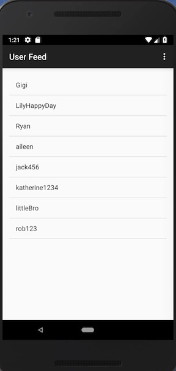

# Mini Instagram Clone

A photo-sharing app to upload photos to share with other users and view other user’s feed.

## Description

* Programming Language & Tools
	* **Java** - constructed the main structure and implementation
	* **AWS**  - save adll user data in the cloud
	* **Android Studio** - development tool used

* Page Sections
	* [Sign up and Login](#sign-up-and-login)
	* [Data Storage](#data-storage)
	* [User List Display](#user-list-display)
	* [Share Photos](#share-photos)
	* [User Feed Viewer](#user-feed-viewer)
	* [Log Out](#log-out)

## Sections
### Sign up and Login
-----------
Users can user their username and password to get into their accounts. 

* Advanced Keyboard Management 
1. Initiating sign up or login process by pressing enter key 

2. shutting down the keyboard by tapping elsewhere on the screen 

### Data Storage
-----------
Set up parse server on AWS instance to save user data in the cloud which could synchronize data across devices with the app. 

### User List Display
-----------
Display a list of all the users, from which you can get to see other user's shared photos. 

### Share Photos
-----------
Simple steps to allow users to import photos wishing to share from Camera or Photos of user’s phone to their photo-sharing places. 

### User Feed Viewer
-----------
Let users to select one to view all the photos the user has shared. 

### Log Out
-----------
Log out the user's account and go back to the login interface. 

## About me
I am **Aileen Yang** living in **San Francisco Bay Area**, and I have just finished my **master** degree in **NYU** in May 2018. 
I am now ***actively seeking for Software Development Engineer full-time position***. 
Welcome to contact my if you would like to [offer me an oppotunity](mailto:yy1910@nyu.edu)! 
Please feel free to contact me if you have any question.
